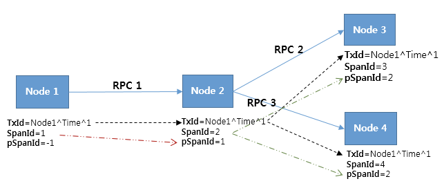
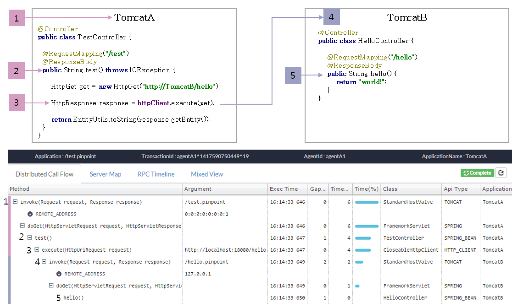
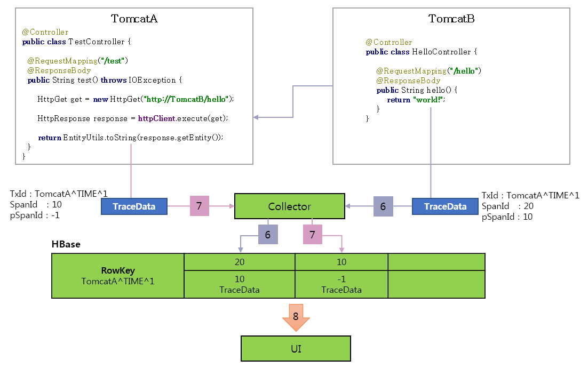

### 一、简介

pinpoint 是由韩国 naver（做搜索引擎的） 网站开源的一款 APM 软件

1、实现原理

在请求header中，增加Trace数据结构，TxId：请求的唯一编号；SpanId：处理请求的服务编号（provider）；pSpanId：调用者的SpanId（Consumer），
通过这一组编号来跟踪请求




### 三、pinpoint应用示例

当在 TomcatA 和 TomcatB 中安装pinpoint的数据。可以把单个节点的跟踪数据看成single traction，提现分布式事务跟踪的流程。



1、当请求到达TomcatA时, Pinpoint agent 产生一个 TraceId.

    TX_ID: TomcatA^TIME^1
    SpanId: 10
    ParentSpanId: -1(Root)

2、从spring MVC 控制器中记录数据

3、插入HttpClient.execute()方法的调用并在HTTPGet中配置TraceId

创建一个子TraceId

- TX_ID: TomcatA^TIME^1 -> TomcatA^TIME^1
- SPAN_ID: 10 -> 20
- PARENT_SPAN_ID: -1 -> 10 (父 SpanId)

在HTTP header中配置子 TraceId

- HttpGet.setHeader(PINPOINT_TX_ID, "TomcatA^TIME^1")
- HttpGet.setHeader(PINPOINT_SPAN_ID, "20")
- HttpGet.setHeader(PINPOINT_PARENT_SPAN_ID, "10")

4、传输打好tag的请求到TomcatB.

TomcatB 检查传输过来的请求的header
- HttpServletRequest.getHeader(PINPOINT_TX_ID)

TomcatB 作为子节点工作因为它识别了header中的TraceId
- TX_ID: TomcatA^TIME^1
- SPAN_ID: 20
- PARENT_SPAN_ID: 10

5、从spring mvc控制器中记录数据并完成请求


6、当从tomcatB回来的请求完成时，pinpoint agent发送跟踪数据到pinpoint collector就此存储在HBase中

7、在对tomcatB的HTTP调用结束后，TomcatA的请求也完成了。pinpoint agent发送跟踪数据到pinpoint collector就此存储在HBase中

8、UI从HBase中读取跟踪数据并通过排序树来创建调用栈


### 绘制流程图 Flowchart

```flow
st=>start: 用户登陆
op=>operation: 登陆操作
cond=>condition: 登陆成功 Yes or No?
e=>end: 进入后台

st->op->cond
cond(yes)->e
cond(no)->op

```

